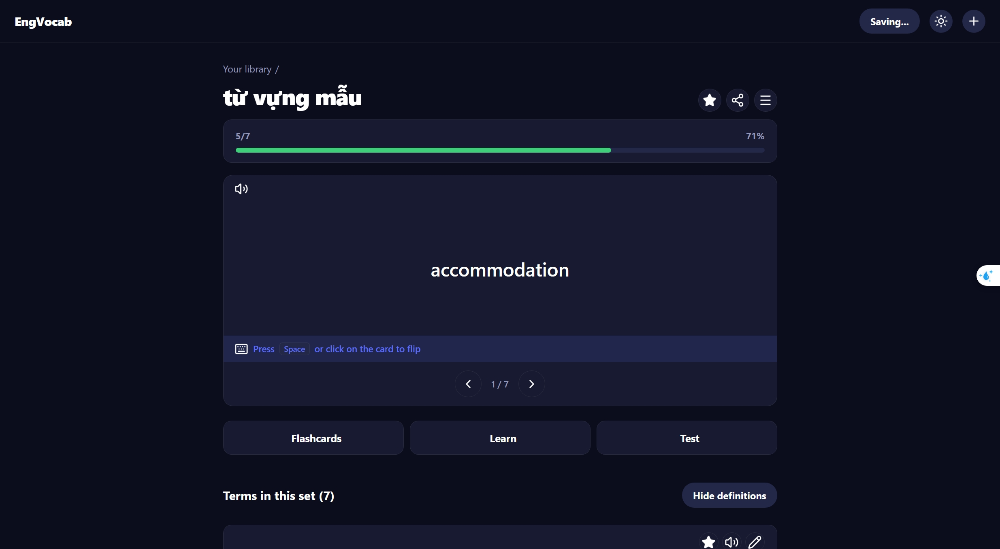
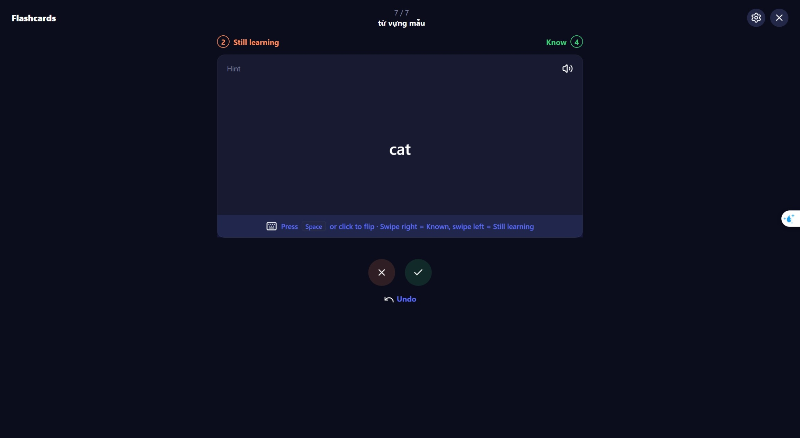
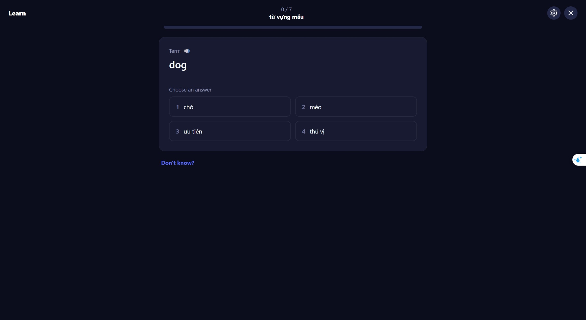
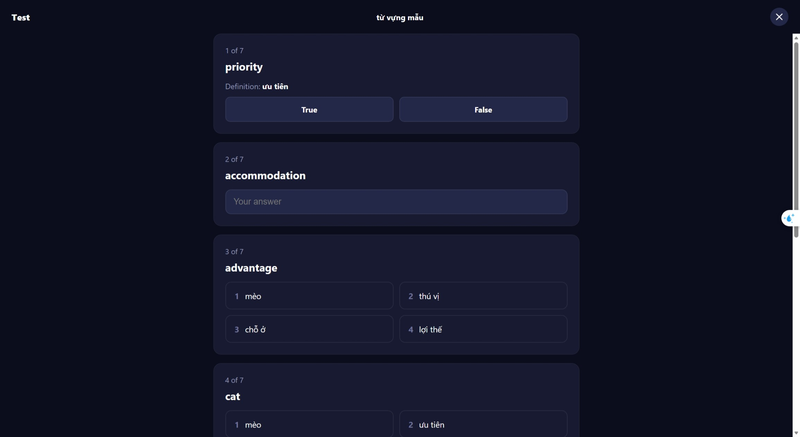

# Eng Vocab App

Ứng dụng học từ vựng tiếng Anh tối giản, chạy 100% trên trình duyệt và hỗ trợ offline hoàn toàn (không cần backend/server). Thích hợp để người học tự học, tự lưu trữ và cài đặt vĩnh viễn trên máy cá nhân.

## 🚀 Tính năng nổi bật
- **Học tập chủ động:** Tạo bộ từ, học bằng flashcard, ôn luyện với chế độ Learn, làm bài kiểm tra và theo dõi chuỗi ngày học (streak).
- **Hoạt động Offline 100% (PWA):** Có thể cài đặt ứng dụng thành phần mềm độc lập trên máy tính/điện thoại. Sau khi cài, ứng dụng hoạt động không cần mạng Internet.
- **Bảo toàn dữ liệu (Backup):** Cho phép kết nối và lưu dữ liệu trực tiếp ra file `.json` trên máy tính (sử dụng *File System Access API*), không lo mất lịch sử học tập.
- **Phát âm từ vựng:** Tích hợp sẵn *Web Speech API (Text-to-Speech)* đọc tiếng Anh chuẩn xác.
- **Giao diện thân thiện:** Tối ưu hóa UI/UX, hỗ trợ Dark Mode và các phím tắt tiện dụng (Space lật thẻ, phím mũi tên đánh dấu từ...).

## 📱 Hướng dẫn sử dụng & Cài đặt

### Cách 1: Sử dụng và Cài đặt từ Web (Khuyên dùng)
Truy cập ứng dụng tại: **[Eng-Vocab Web](https://anlabs-cs.github.io/eng-vocab-app/)**

**Để cài đặt ứng dụng về máy tính (Dùng vĩnh viễn không cần mạng):**
1. Mở link web bằng trình duyệt **Google Chrome** hoặc **Microsoft Edge**.
2. Nhấn vào nút **"⬇ Cài App"** trên thanh menu trên cùng của ứng dụng.
3. *(Hoặc)* Nhìn lên góc bên phải của thanh địa chỉ (Address bar) của trình duyệt, bạn sẽ thấy biểu tượng màn hình máy tính có dấu `+` (Install). Nhấn vào đó.
4. Chọn **Install/Cài đặt**. Ứng dụng sẽ được tạo shortcut ngoài màn hình Desktop. Từ nay, bạn mở nó lên học bình thường kể cả khi ngắt kết nối Wifi.

### Cách 2: Chạy cục bộ trên máy (Mã nguồn tải về)
Nếu bạn tải mã nguồn gốc `.zip` về máy, bạn nên chạy ứng dụng thông qua script tích hợp sẵn để không bị trình duyệt chặn tính năng lưu file:
- **Trên Windows:** Nháy đúp vào file `start.bat`.
- **Trên Mac/Linux:** Mở Terminal ở thư mục gốc và chạy `./start.sh`.
- Trình duyệt sẽ tự động hướng dẫn bạn vào địa chỉ `http://localhost:8765`.

## 📸 Demo

| Danh sách bộ từ | Flashcards |
|---|---|
|  |  |

| Chế độ Learn | Chế độ Test |
|---|---|
|  |  |

## 🛠 Tech Stack
- Frontend: HTML5, CSS3, Vanilla JavaScript.
- Offline Core: Service Worker (PWA Manifest).
- Browser APIs: Web Speech API, File System Access API.
